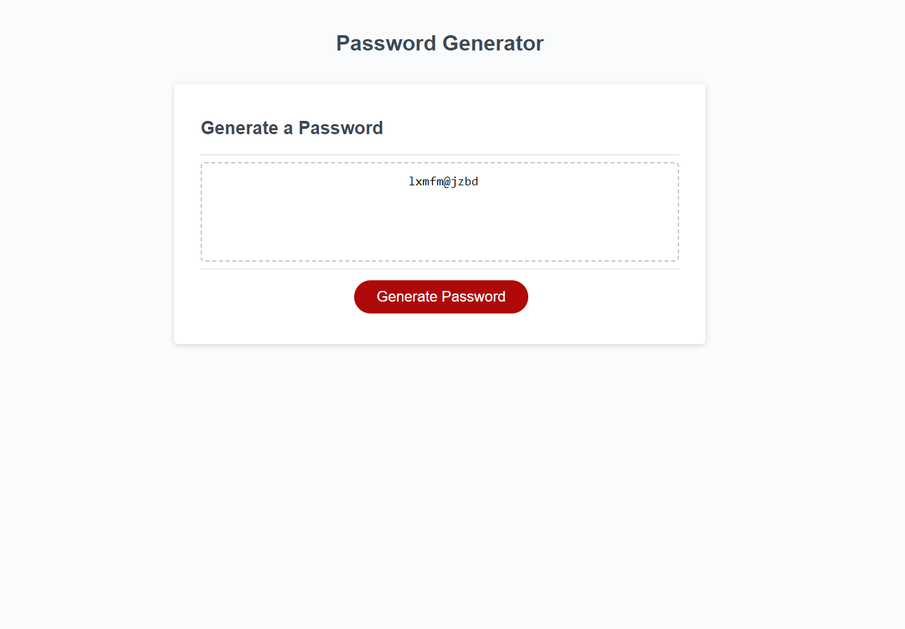

# Random-Password-Generator

## Description

This project was undertaken to add the javascript functionality to a password generator based on criteria chosen by the user. It gives the  option of length of the password as well as which types of characters you would like it to include such as upper or lower case, numbers, and special characters.

The project uses HTML, CSS, and Javascript although i was only responsible for the Javascript portion.

## Installation

N/A

## Usage

The page can be accessed via this link: https://loganlagrange.github.io/Random-Password-Generator/

The page is used by clicking the generate password button at which point the user will be presented with a series of prompts for what they would like their password to include. These include the length (which must be both a number and the correct length or it will fail) whether to include lower case, upper case, numbers, and special characters. If no criteria are selected the program will inform the use that at least 1 must be selected for a password to be generated. If all mandatory criteria are present the password will be written to the page in the box above the button.

## Credits
N/A

Note: I did not include any code written by another person but i did do my own research and referenced w3schools and stack overflow for the Number.isNaN method and the .charAt method in order to learn how to use them correctly to determine how to test against improper input and how to add a character into a string at a certain index location

## License
See LICENSE in repo.